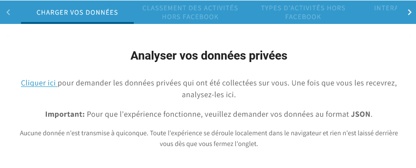

# Exemple de déploiement d'hestialabs-experiences

Ceci est un exemple de déploiement de l'application hestialabs-experiences sous forme de fichiers, sur un serveur où pourrait tourner aussi un cms. Il est déployé [ici](https://deployment-example-experiences.netlify.app/)

L'exemple est conçu pour être déployé gratuitement chez netlify, un hébergeur de sites statiques. Nous simulons un serveur tel que ngninx ou apache par des redirections d'url configurées dans le fichier **netlify.toml**.

## Répertoires et fichiers
- cms: dossier contenant les fichiers simulant le cms
- experiences: dossier contenant les fichiers de l'application
- config.json: configuration de l'application, ou on peut notamment choisir la langue, indiquer de quelle url télécharger les textes de traduction, et changer les couleurs du thème.
- netlify.toml: configuration des redirections


## Intégration du cms

Nous simulons un cms par les fichiers dans le répertoire *cms* accessibles à l'url **/cms/[nom-du-fichier]**. Dans un déploiement de production, ces urls pointeraient vers un cms qui génère un contenu du même format dynamiquement. L'intégration ce résume à deux urls:

### Page d'accueil [/cms/index.html](https://deployment-example-experiences.netlify.app/cms/index.html)

Cette page est générée par le CMS. Le serveur doit être configuré pour qu'elle soit la page d'accueil du domaine. 

La page d'accueil peut contenir des liens vers une experience de notre application. 


``` html
<li><a href="experience/facebook">facebook</a></li>
<li><a href="experience/twitter">twitter</a></li>
```

La liste des expériences accessibles dans notre application se trouve dans sa configuration **config.json**
``` json
  "experiences": [
    "facebook",
    "twitter",
    "instagram",
    "linkedin",
    "uber",
    "google",
    "tinder",
    "netflix",
    "explorer"
  ],
```
 
Dans le même fichier, notre application est configurée pour qu'un click sur l'icone maison renvoie vers la page d'accueil. 

``` json
  "homePath": "/",
```

### Fichier de traduction [/cms/i18n-messages.json](https://deployment-example-experiences.netlify.app/cms/i18n-messages.json)

Les textes configurés dans ce fichier de traduction remplacent les textes que l'application affiche par défaut. Tous les textes de l'application sont configurables de cette manière.

L'url où l'application va chercher ce fichier est spécifiée dans le fichier config.json

``` json
  "i18nUrl": "/cms/i18n-messages.json",
```

Un cms pourrait générer dynamiquement un fichier json dans ce format à partir des contenus qu'il vous permet d'éditer.

Sa structure est faite d'objets json imbriqués. Si vous voulez changer un texte particulier, le plus simple est de nous dire à quel endroit il apparait dans l'application et nous vous dirons à quel endroit mettre le texte dans le fichier de traduction (son adresse).

Dans cet exemple, nous avons configuré explicitement les textes de la page d'accueil d'une expérience.

``` json
{
  "fr": {
    "load-data": {
      "title": "Analyser vos données privées",
      "link-text": "Cliquer ici",
      "text": "pour demander les données privées qui ont été collectées sur vous. Une fois que vous les recevrez, analysez-les ici.",
      "text-default": "Explorer la structure et le contenu de vos fichiers.",
      "disclaimer": "Aucune donnée n'est transmise à quiconque. Toute l'expérience se déroule localement dans le navigateur et rien n'est laissé derrière vous dès que vous fermez l'onglet."
    },
    "experiences": {
      "facebook": {
        "intro": {
          "dataPortalHtml": "Ce texte est configuré dans le fichier <a href=\"/cms/i18n-messages.json\">/cms/i18n-messages.json</a>"
        }
      }
    }
  }
}
```

Pour modifier le texte d'introduction de twitter, il suffirait d'ajouter à l'objet "experiences" une propriété "twitter" au même format que l'objet "facebook".

#### Structure de la page d'accueil d'une expérience
 
 

Le texte est fait d'un titre et de trois paragraphes. Le premier paragraphe peut être configuré de plusieurs manières différentes.

Certains textes sont spécifiques à une expérience, d'autres sont les mêmes partout. Un texte spécifique à l'expérience twitter aura toujours une adresse qui commence par *experiences.twitter*. 

| Texte                    | Exemple                 | Adresse (exemple pour twitter)        |
|--------------------------|-------------------------|---------------------------------------|
| Titre                    | Analysez vos données    | load-data.title                       |
| Paragraphe 1 (version a) |                         |                                       |
| . url du lien            | https://help.twitter.com/... | experiences.twitter.dataPortal       |
| . texte du lien          | Cliquer ici             | load-data.link-text                   |
| . texte suivant le lien  | pour demander ...       | load-data.text                        |
| Paragraphe 2             | Important: Pour ...     | experiences.twitter.dataPortalMessage |
| Paragraphe 3             | Aucune donnée n'est...  | load-data.disclaimer                  |

La plupart de nos experiences ont une valeur par défaut pour l'url *dataPortal*, mais ce n'est pas actuellement le cas pour netflix.

 
Cette image montre un exemple de la deuxième manière de spécifier le premier paragraphe.

| Texte                            | Exemple                    | Adresse (exemple pour facebook)     |
|----------------------------------|----------------------------|-------------------------------------|
| Paragraphe 1 (version b)         |                            |                                     |
| . texte pouvant contenir du html | Ce texte est configuré ... | experiences.facebook.dataPortalHtml |

Si le paragraphe n'est pas configuré comme dans la version b, et que l'expérience ne spécifie pas l'url dataPortal nécessaire pour afficher la version a, la version c est affichée.

| Texte                            | Adresse                |
|----------------------------------|------------------------|
| Paragraphe 1 (version c)         |                        |
| . texte pouvant contenir du html | load-data.text-default |

Dans l'exemple déployé sur ce site, 
[facebook](https://deployment-example-experiences.netlify.app/experiences/facebook) un paragraphe 1 version b parce que dataPortalHtml est configuré dans le fichier de traduction,
[twitter](https://deployment-example-experiences.netlify.app/experiences/twitter) a un paragraphe 1 version a, parce que l'url dataPortal a une valeur par défaut, et 
[netflix](https://deployment-example-experiences.netlify.app/experiences/netflix) un paragraphe version c.

## Servir le site localement
Une librairie javascript de netlify permet de servir cet exemple sur son propre ordinateur.

Pour installer l'outil
``` sh
npm install netlify-cli -g
```

Pour lancer le serveur local
``` sh
netlify dev
```

## Déploiement d'une nouvelle version

Lors d'une mise à jour de l'application, il faut mettre à jour le répertoire experiences. L'ensemble des fichiers à mettre dans ce dossier constitue le livrable d'hestia.ai

Voici un exemple de déploiement si les nouveaux fichiers se trouvent dans le dossier *../hestialabs-experiences/experiences/dist*
``` sh
rm -rf experiences
cp -r ../hestialabs-experiences/experiences/dist experiences
```

### Commande de build pour créer experiences

Cette étape sera effectuée par hestia.ai. L'ensemble de fichiers livrables est généré dans le projet [hestialabs-experiences](https://github.com/hestiaAI/hestialabs-experiences) selon les instructions de déploiement qui s'y trouvent. La commande de build utilisée pour cet exemple est celle-ci:

``` sh
BASE_URL="https://deployment-example-experiences.netlify.app/" CONFIG_NAME="barebones" npm run build
```


